# EnjoyTrip (임시)

# 목차

[1. 요구사항 정의](#1.-요구사항-정의) 
[2. ER Diagram](#2.-ER-Diagram) 
[3. 페이지 설계](#3.-페이지-설계) 
[4. Postman 목록](#4.-Postman-목록) 
---
# 1. 요구사항 정의
## 기능적 요구사항
|요구사항명|요구사항 상세|
|-|-|
|지역별 관광지 정보 수집|한국관광공사 : 지역별 관광지 정보를 얻어와 화면에 표시|
|관광지, 숙박, 음식점 조회| 관광지 정보를 지역별 원하는 컨텐츠 별 조회.|
|문화시설, 공연, 여행코스, 쇼핑 조회|관광지 정보를 지역별 원하는 컨텐츠 별 조회.|
|여행 계획 경로 설정|조회한 관광지를 활용하여 여행
계획, 여행 경로를 저장|
|회원 관리| 회원가입, 수정, 조회, 탈퇴|
|로그인 관리| 로그인 / 로그아웃 / 비밀번호 찾기|
| 공지사항 | 공지사항 등록, 수정, 삭제, 조회

## 비기능적 요구사항
|요구사항명|요구사항 상세|
|-|-|
|공공데이터의 정확성| 공공데이터 API를 활용함으로 인한 공공데이터의 정확성이 요구됨|
|가용성| 언제나 (어떤 디바이스로든)서비스 가능해야 함|
|응답성| 조회에 대한 결과를 빠르게 응답해야 함|
사용자 편의성 | 웹 사이트에 대한 사전 지식이 없어도 쓰기 편해야 함|

# 2. ER Diagram
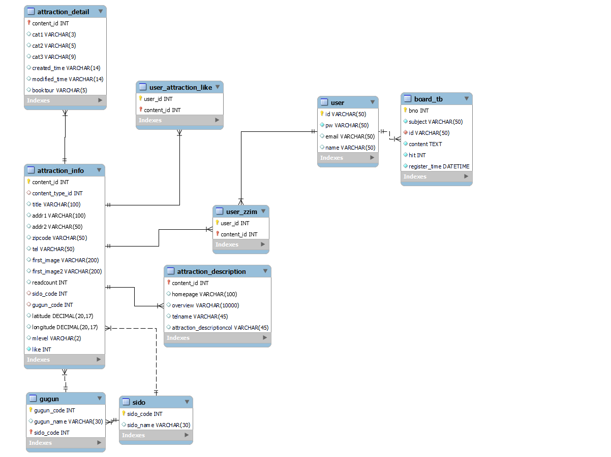

# 3. 페이지 설계
## 3-1. 메인 페이지
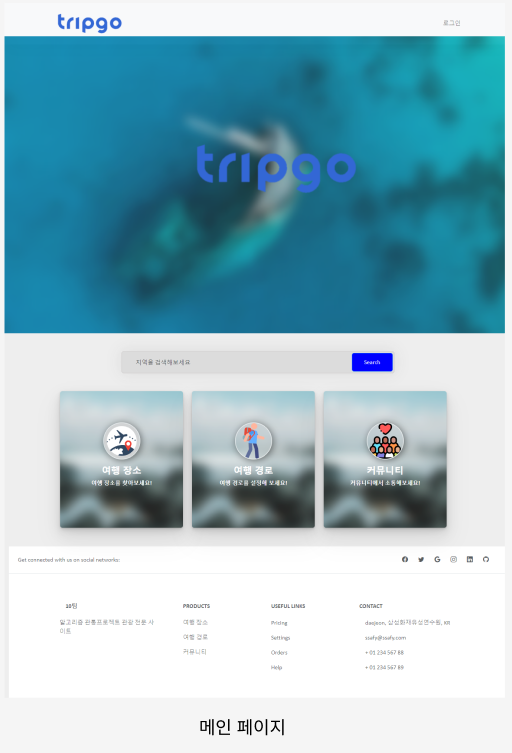
### 3-1-1. nav
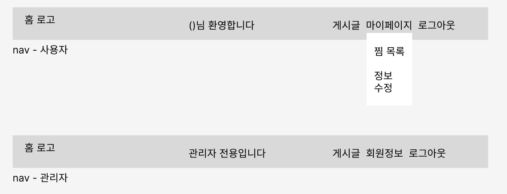

## 3-2. 로그인
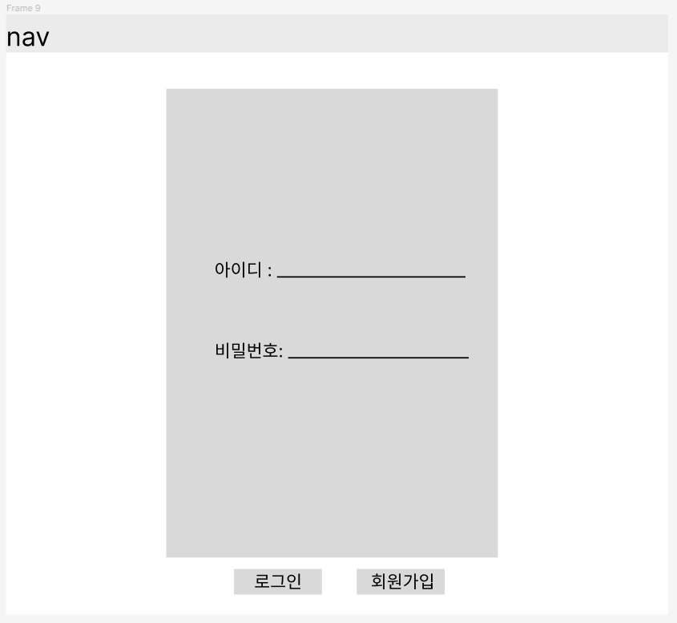
### 3-2-1. 로그인 postman
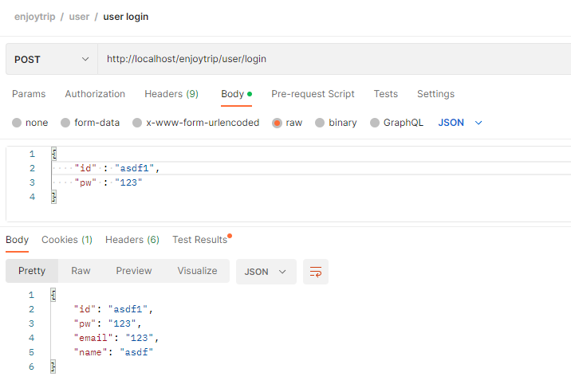

## 3-3. 마이페이지
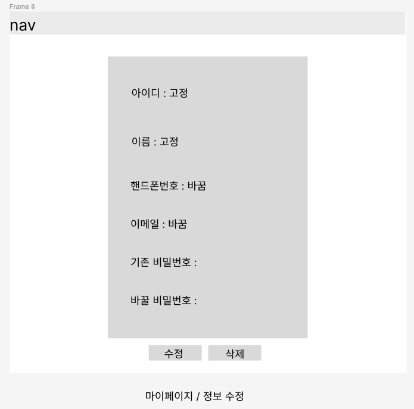
### 3-3-1. 마이페이지 postman
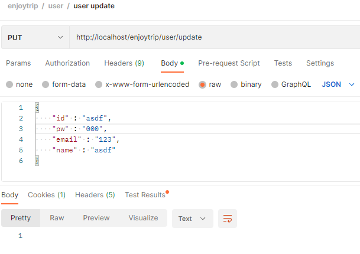

## 3-4. 관리자 / 회원정보
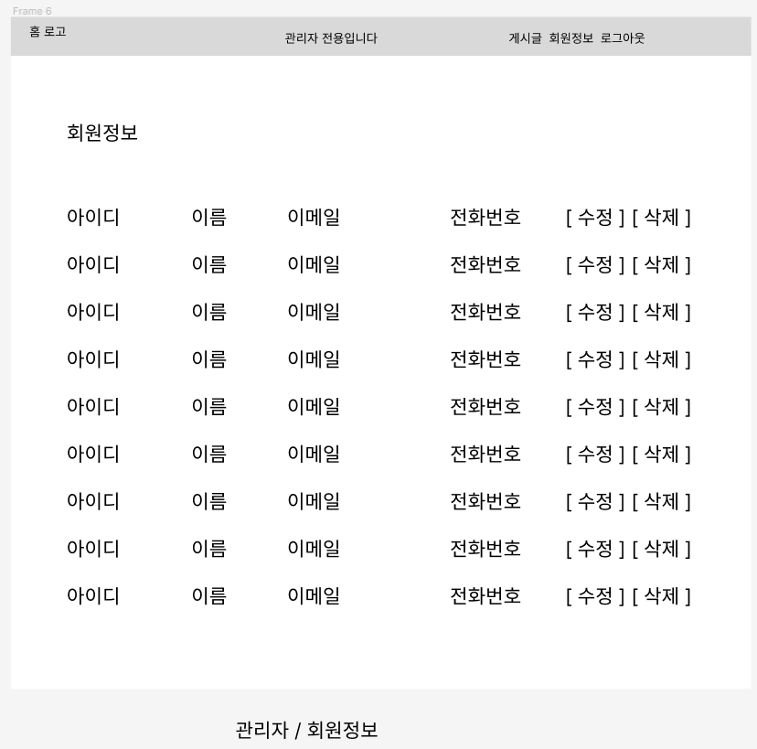
### 3-4-1. 관리자 / 회원정보 postman
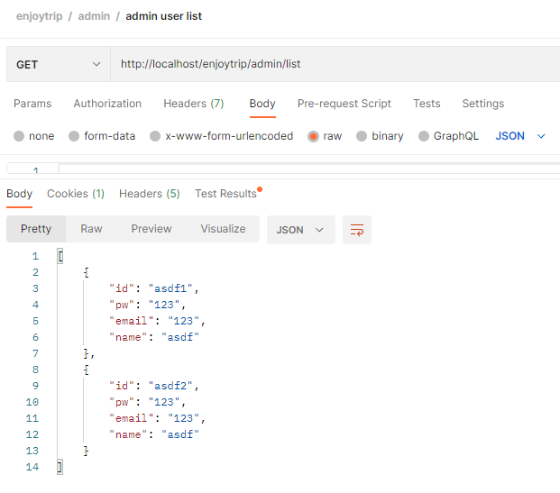

## 3-5. 관광지 리스트
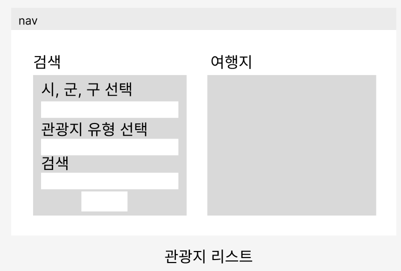
### 3-5-1. 관광지 리스트 postman
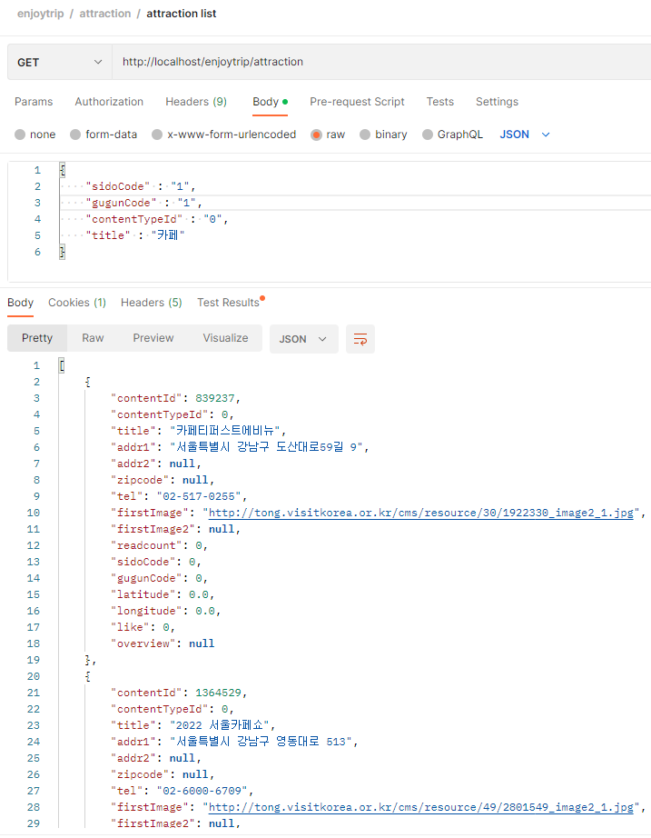 
서울시 강남구에 있는 카페를 찾아보았습니다.

## 3-6. 관광지 상세페이지

### 3-6-1. 관광지 상세페이지 postman
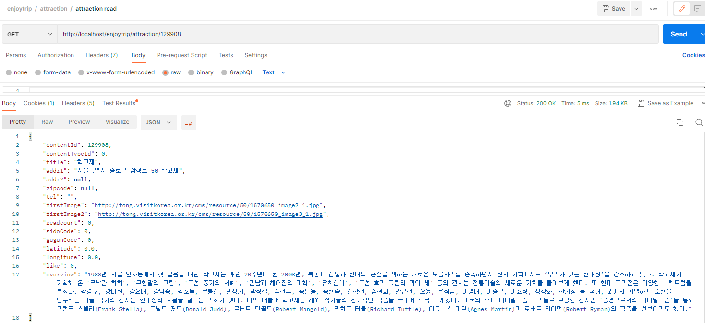

## 3-7. 게시물
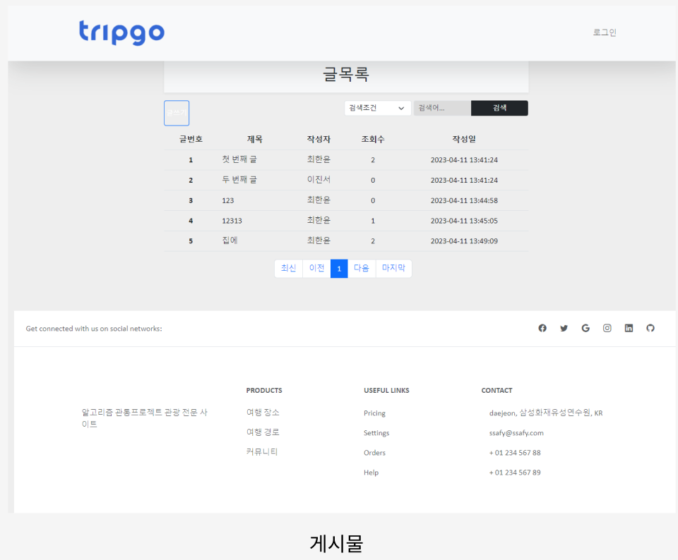
### 3-7-1. 게시물 postman
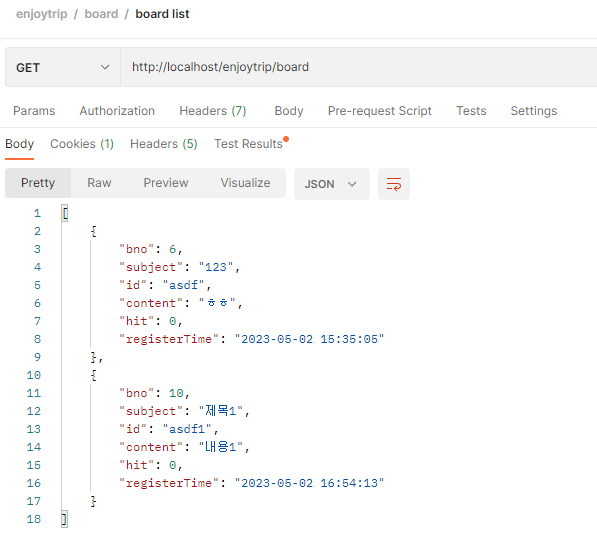

# 4. Postman 목록
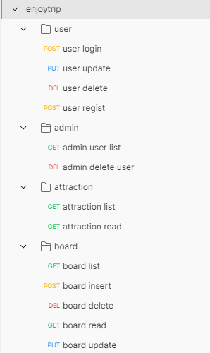
